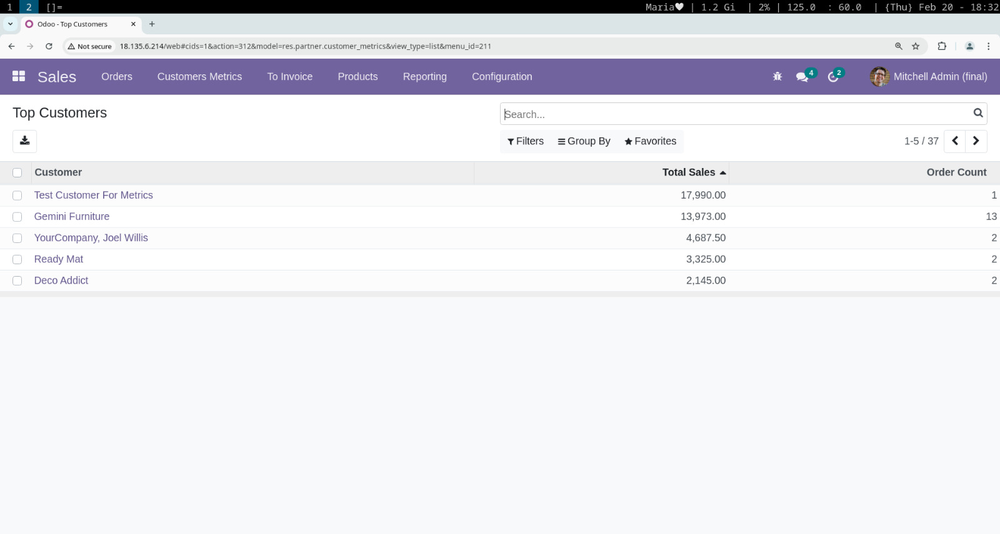

# Customer Metrics Dashboard (Odoo 15)

## Introduction

Welcome to the Customer Metrics Dashboard Odoo module!

This module provides a dashboard to list the **top 5 customers** based on total sales and order count. It helps businesses track their most valuable clients directly from the Sales menu.

### Features:
- Computes **total sales** and **order count** per customer.
- Displays the **top 5 customers** in a structured dashboard.
- Integrated with Odoo's Sales module for seamless access.

### Note:
This module is actively developed and open to improvements. Contributions, feedback, and suggestions are highly welcome! Remember: **RTFM** (Read The F*cking Manual) and **KISS** (Keep It Simple, Stupid!). 

## Screenshot

1. **Customer Metrics List View**  

   

## Installation

To install the Customer Metrics Dashboard module, follow these steps:

1. **Clone the Repository:**

   Clone the `customer_metrics` directory into your custom addons path:

   ```bash
   git clone https://github.com/mahmoudElshimi/customer_metrics.git /path/to/odoo/custom/addons/
   ```

2. **Restart Odoo and Update App List:**

   ```bash
   sudo systemctl restart odoo
   ```

   Then, go to *Apps* → Click *Update Apps List*.

3. **Install the Module:**

   Find *Customer Metrics Dashboard* in the Apps menu and click *Install*.

## Links

- [Odoo GitHub Repository](https://github.com/odoo/odoo)
- [Odoo 15 Installation Guide](https://www.odoo.com/documentation/15.0/administration/on_premise.html)

## How to Contribute

Feel free to fork this repository, raise issues, and create pull requests. All contributions are welcome, following the **RTFM** and **KISS** principles! 

